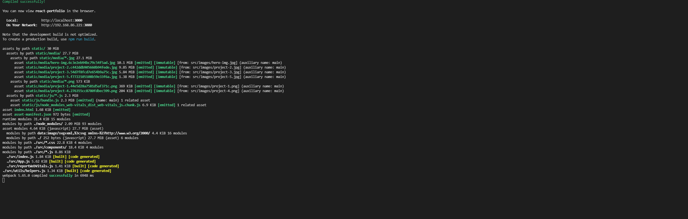
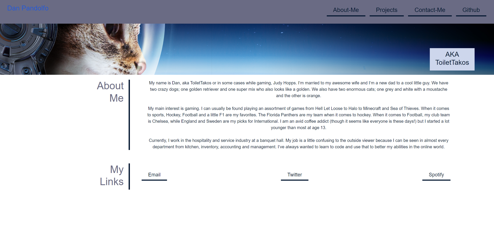
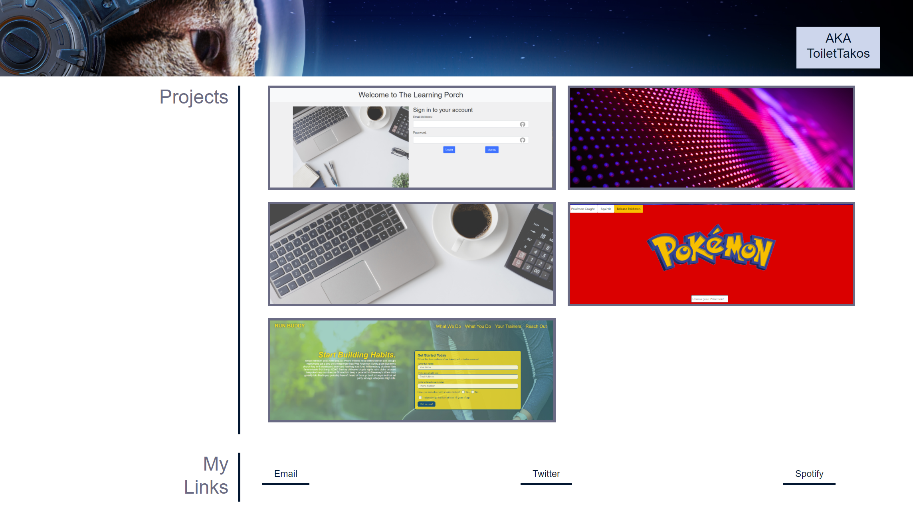
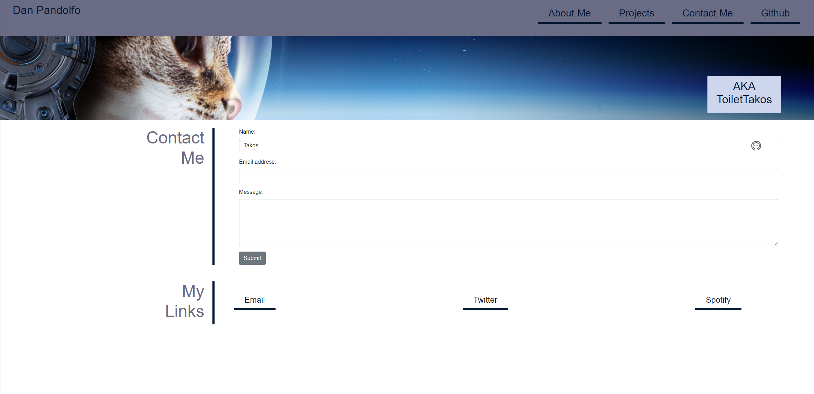
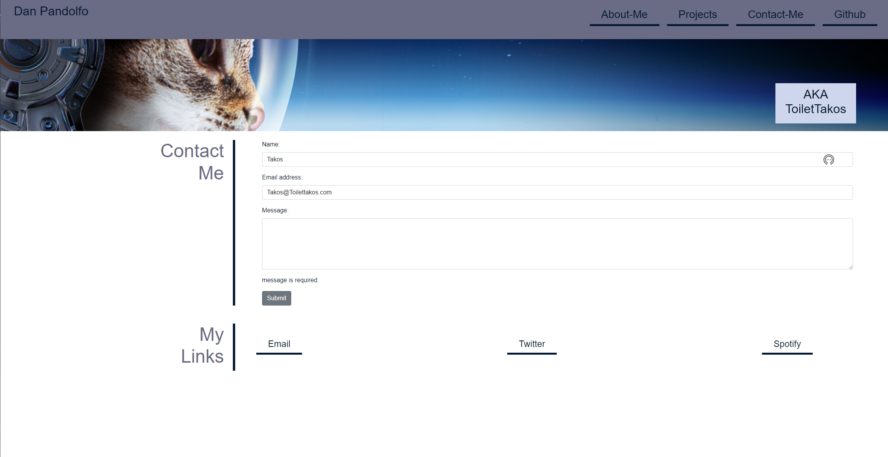

# 20. React Challenge: React Portfolio

Now that you’ve completed multiple projects, your task is to create a portfolio, using your new React skills to help set you apart from other developers whose portfolios don’t use the latest technologies.

## Steps

* Created the github repository
* npx create-react-app react-portfolio to create the base files
* installed libraries needed aswell as bootstrap for styling
* Created the base html file to display everything on one page 
* broke up the working html into components(Nav, About, Contact, and Projects)
* created the proper functionality in the nav to render each page on selecting the tab
* Created the contact error handling for not valid email and no information entered in the message feild
* stylized the projects page and made each project clickable to their deployed locations
* updated the scripts to allow for the build and deploy
* Handled the last bit few errors and wrote up the Readme

## Screenshots

Display the console out put showing launched to the localhost with no errors

The About page is the home page when launching the app.

Displays the ObjectStore with the offline added entry.

Displaying the contact page.

Displaying the error when email is not entered or not entered properly.

Displaying the error for missing message.

## Links

* Deployed Url: https://toilettakos.github.io/react-portfolio/

* Github: https://github.com/ToiletTakos/react-portfolio
